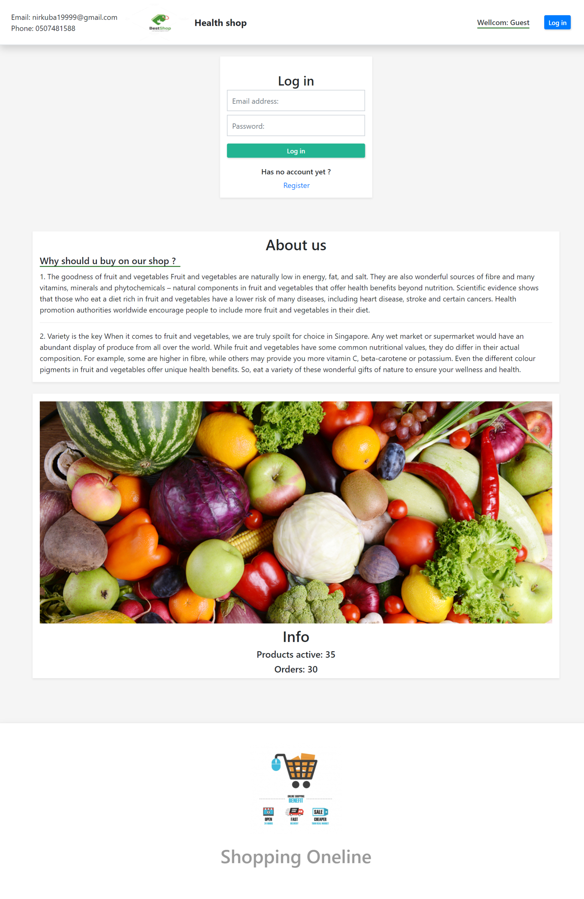
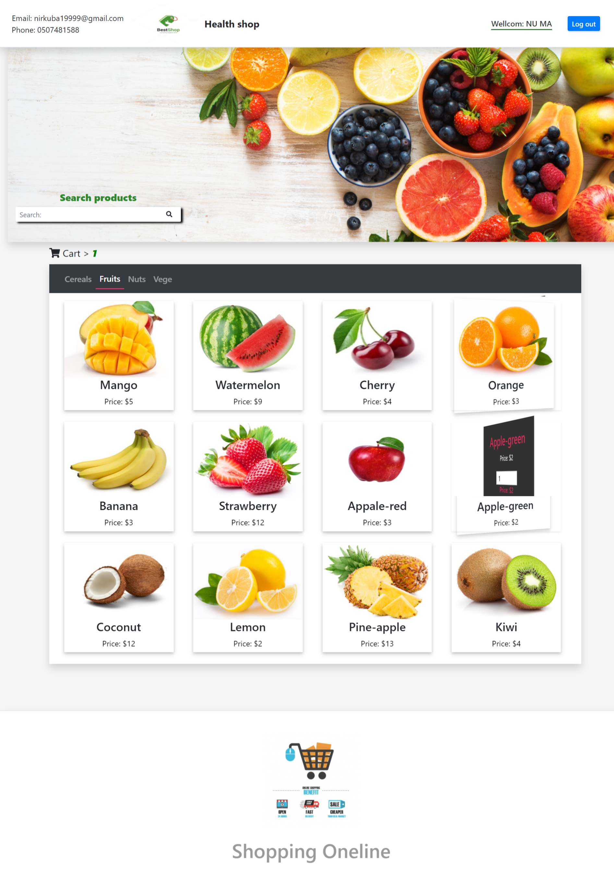
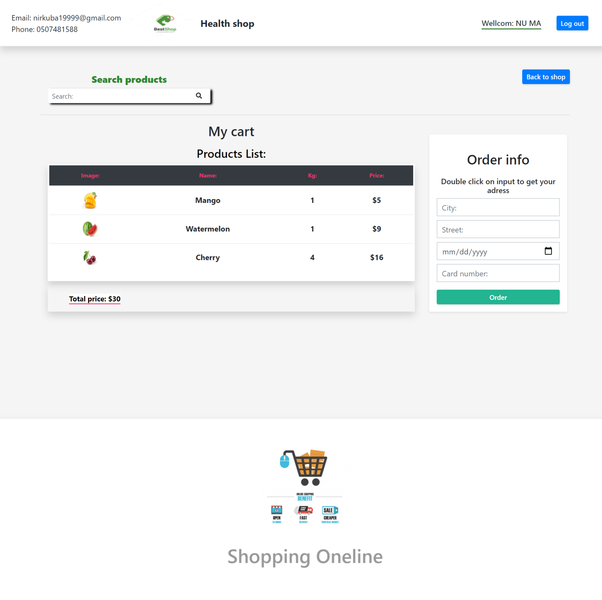
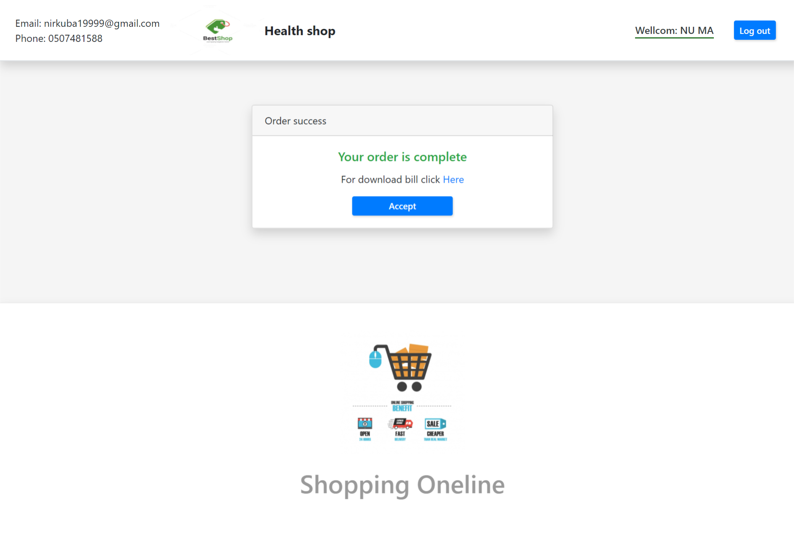
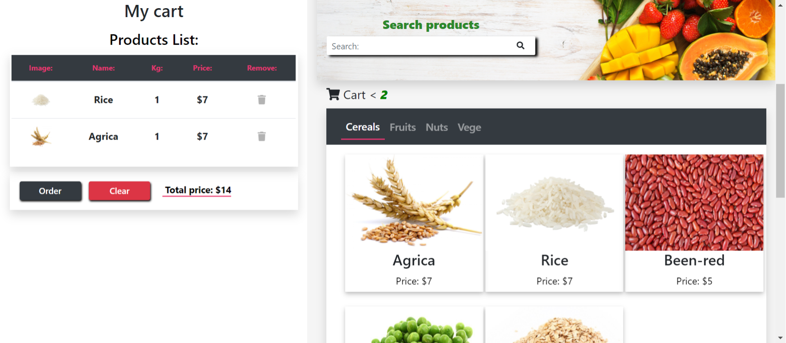
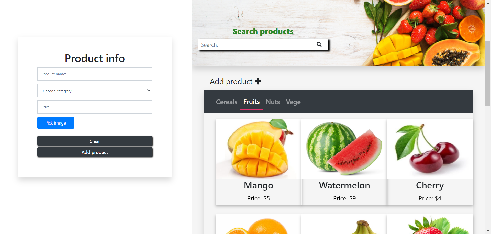

# shop-online

* 1- clone the project
* 2- cd to shop-online folder
* 3- run on command: npm install
* 4- run on command ng b (build dist folder)
* 5 - import sql file shopping_online.sql to your local machine 
* 6 - run coammand: node server.js
* 7 - open browser on: http://localhost:4567

# Admin mode -  
* email: admin@gmail.com
* password: 1qaz2WSX

